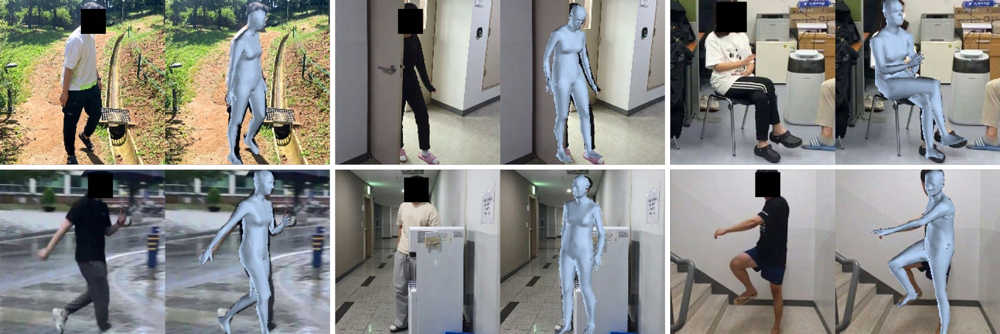
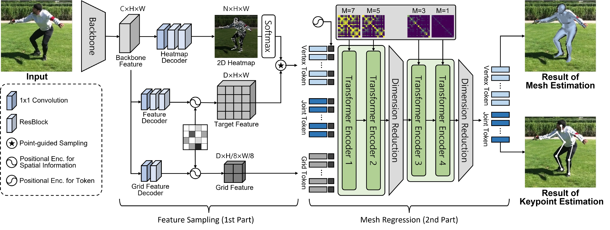

# PointHMR

This repository is a official Pytorch implementation of the paper [**"Sampling is Matter: Point-guided 3D Human Mesh Reconstruction"**](https://) <br>
Jeonghwan Kim*, Mi-Gyeong Gwon*, Hyunwoo Park, Hyukmin Kwon, Gi-Mun Um, and Wonjun Kim (Corresponding Author) <br>
\* equally contributed <br>
:maple_leaf: ***IEEE International Conference on Computer Vision and Pattern Recognition (CVPR)***, Jun. 2023. :maple_leaf:

<p align="center"></p>

## Overview :eyes:
- We propose to utilize the correspondence between encoded features and vertex positions, which are projected into the 2D space, via our point-guided feature sampling scheme. By explicitly indicating such vertex-relevant features to the transformer encoder, coordinates of the 3D human mesh are accurately estimated.
- Our progressive attention masking scheme helps the model efficiently deal with local vertex-to-vertex relations even under complicated poses and occlusions.

<p align="center"></p>


## How to use it

### Try on Google Colab
It allows you to run the project in the cloud, free of charge.  </br>
Let's give the prepared [Google Colab demo](https://colab.research.google.com/) a try.

### Installation

Please refer to [Installation.md](documents/Installation.md) for installation.

### Download

We provide guidelines to download pre-trained models and datasets. </br>
Please check [Download.md](documents/Download.md) for more information.

### Demo

We provide demo codes to run end-to-end inference on the test images. </br>
Check [Demo.md](documents/Demo.md) for details

| Model                        | Dataset   | MPJPE | PA-MPJPE | Link            |
| ---------------------------- | --------- | ----- | -------- | --------------- |
| PointHMR-HR32                | Human3.6M |48.3   | 32.9     | [Download]()|
| PointHMR-HR32                | 3DPW      |73.9   | 44.9     | [Download]()|

### Experiments
We provide guidelines to train and evaluate our model on Human3.6M, 3DPW and FreiHAND. </br>
Please check [Experiments.md](documents/Experiments.md) for more information.

## Acknowledgments
This work was supported by Institute of Information \& communications Technology Planning \& Evaluation(IITP) grant funded by the Korea government(MSIT) (2021-0-02084, eXtended Reality and Volumetric media generation and transmission technology for immersive experience sharing in noncontact environment with a Korea-EU international cooperative research).

Our implementation and experiments are built on top of open-source GitHub repositories. We thank all the authors who made their code public, which tremendously accelerates our project progress. If you find these works helpful, please consider citing them as well.

[microsoft/MeshTransformer](https://github.com/microsoft/MeshTransformer)  </br>
[microsoft/MeshGraphormer](https://github.com/microsoft/MeshGraphormer)  </br>
[postech-ami/FastMETRO](https://github.com/postech-ami/FastMETRO)  </br>
[Arthur151/ROMP](https://github.com/Arthur151/ROMP)  </br>
[hongsukchoi/Pose2Mesh_RELEASE](https://github.com/hongsukchoi/Pose2Mesh_RELEASE) </br>


## Citation
```bibtex
@InProceedings{PointHMR,
author = {Kim, Jeonghwan and Gwon, Mi-Gyeong and Park, Hyunwoo and Kwon, Hyukmin and Um, Gi-Mun and Kim, Wonjun},
title = {{Sampling is Matter}: Point-guided 3D Human Mesh Reconstruction},
booktitle = {CVPR},
month = {June},
year = {2023}
}
```
<!--
## License
 -->
