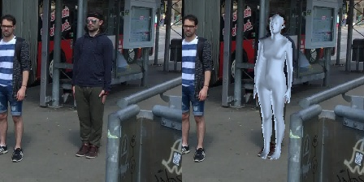

## Quick Demo

We provide demo codes for end-to-end inference here.

Our inference codes will iterate all images in a given folder, and generate the results.

**This demo doesn't perform human detection. Please use the cropped image with the person centered.** 


Run the demo by following the command. 

```
sh script/demo.sh
```

- resume_checkpoint: Path to the checkpoint. 
- image_file_or_path: Path of images to infer.
- image_output_dir: The output directory to save results.


After running, it will generate the results in the folder of 'image_output_dir' </br> 
